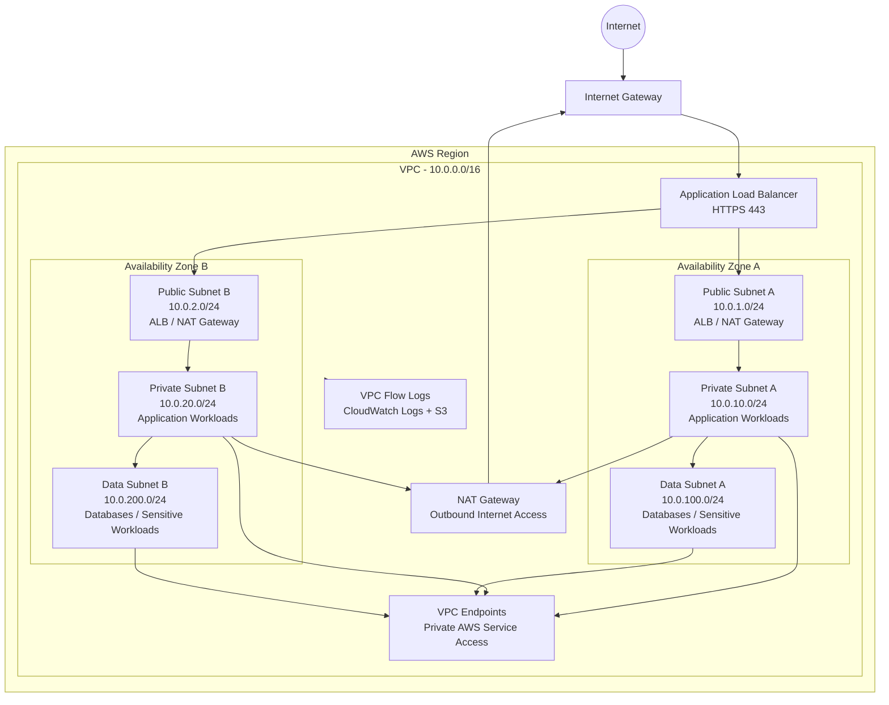
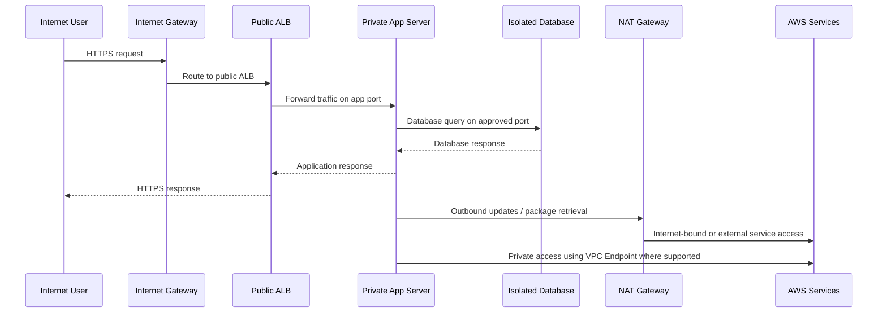
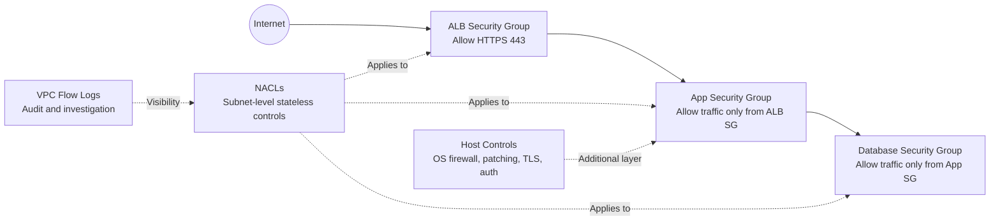
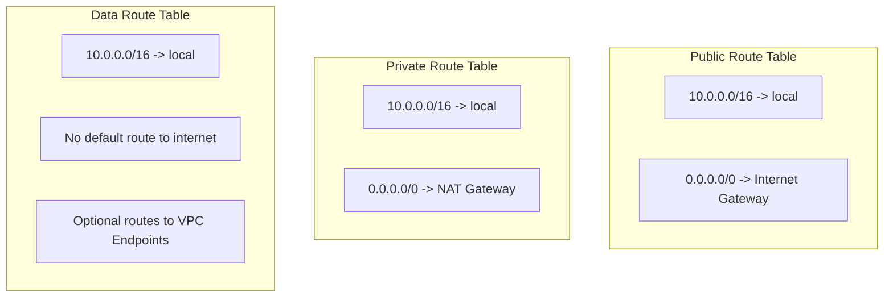
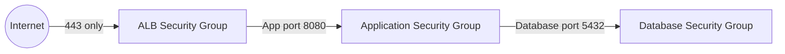
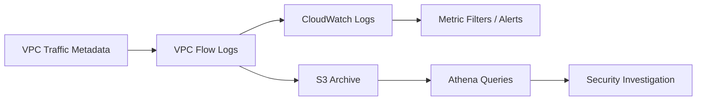

# Secure Multi-Tier AWS VPC Architecture with Terraform


## Summary

This project demonstrates how to design and deploy a **secure, production-style AWS VPC** using **Terraform**.

The goal is not just to create a VPC. The goal is to show how a Cloud Security Engineer would design a network foundation with:

- Network segmentation
- Least-privilege access control
- Private application workloads
- Isolated data subnets
- Controlled egress through NAT Gateways
- Private AWS service access through VPC Endpoints
- Network visibility using VPC Flow Logs
- Infrastructure as Code validation and security scanning


---

## Scenario

A company is deploying a web application into AWS and requires a secure network foundation.

The application must be reachable from the internet through a controlled entry point, but application servers and databases must not be directly exposed to the public internet.

This project implements that requirement using a multi-tier AWS VPC architecture:

- **Public subnets** for internet-facing components such as an Application Load Balancer and NAT Gateways
- **Private subnets** for application workloads
- **Isolated data subnets** for databases and sensitive workloads
- **VPC Flow Logs** for visibility, audit, and investigation
- **VPC Endpoints** for private access to supported AWS services
- **Terraform** for repeatable and reviewable infrastructure deployment

---

## What This Project Demonstrates

This project demonstrates practical skills across AWS networking, cloud security, Terraform, and DevSecOps-style validation.

| Area | Demonstrated Capability |
|---|---|
| AWS Networking | VPC, subnets, route tables, Internet Gateway, NAT Gateway, VPC Endpoints |
| Cloud Security | Network segmentation, least privilege, isolated data tier, attack surface reduction |
| Infrastructure as Code | Terraform modules/files, variables, outputs, repeatable deployment |
| Visibility | VPC Flow Logs to CloudWatch Logs and S3 |
| DevSecOps | Terraform validation, linting, IaC security scanning |
| Documentation | Architecture explanation, security decisions, threat model, validation evidence |
| Interview Readiness | STAR explanation, trade-offs, production enhancement discussion |

---

## Architecture Diagram



---

## Traffic Flow Diagram



---

## Defense-in-Depth Model



---

## Network Design

| Tier | Subnet | CIDR | Internet Access | Purpose |
|---|---|---:|---|---|
| Public | Public A | 10.0.1.0/24 | Direct via Internet Gateway | ALB, NAT Gateway, optional bastion |
| Public | Public B | 10.0.2.0/24 | Direct via Internet Gateway | ALB, NAT Gateway for high availability |
| Private | Private A | 10.0.10.0/24 | Outbound only through NAT Gateway | Application workloads |
| Private | Private B | 10.0.20.0/24 | Outbound only through NAT Gateway | Application workloads |
| Data | Data A | 10.0.100.0/24 | No default internet route | Databases and sensitive workloads |
| Data | Data B | 10.0.200.0/24 | No default internet route | Databases and sensitive workloads |

---

## Route Table Design



### Routing Summary

| Route Table | Associated Subnets | Default Route | Security Purpose |
|---|---|---|---|
| Public route table | Public subnets | `0.0.0.0/0 -> Internet Gateway` | Allows internet-facing entry points |
| Private route table | Private application subnets | `0.0.0.0/0 -> NAT Gateway` | Allows outbound-only access for patching and updates |
| Data route table | Data subnets | No default internet route | Keeps sensitive workloads isolated from public internet paths |

---

## Security Controls

| Security Control | Implementation | Why It Matters |
|---|---|---|
| Network segmentation | Public, private, and data subnet tiers | Separates trust zones and reduces blast radius |
| Least-privilege Security Groups | ALB SG -> App SG -> DB SG | Prevents broad network access between tiers |
| Isolated data tier | No internet route from data subnets | Reduces exposure of databases and sensitive workloads |
| Controlled egress | Private subnets use NAT Gateway | Allows patching without inbound internet exposure |
| VPC Endpoints | Private access to supported AWS services | Reduces reliance on public internet routes |
| NACLs | Subnet-level stateless filtering | Provides an additional coarse-grained control layer |
| VPC Flow Logs | Logs sent to CloudWatch Logs and S3 | Supports audit, troubleshooting, and incident investigation |
| Terraform | Infrastructure defined as code | Makes infrastructure repeatable, reviewable, and version-controlled |
| IaC scanning | Checkov, tfsec, TFLint | Catches misconfigurations before deployment |

---

## Security Group Design



### Example Security Group Intent

| Security Group | Inbound Rule | Source | Purpose |
|---|---|---|---|
| ALB SG | TCP 443 | `0.0.0.0/0` | Accept HTTPS from internet users |
| App SG | TCP 8080 | ALB Security Group | Allow only ALB-to-app traffic |
| DB SG | TCP 5432 | App Security Group | Allow only app-to-database traffic |

The key design principle is to use **Security Group references** instead of broad CIDR ranges wherever possible.

---

## Security Groups vs NACLs

| Security Groups | Network ACLs |
|---|---|
| Applied at ENI/resource level | Applied at subnet level |
| Stateful | Stateless |
| Allow rules only | Allow and deny rules |
| Can reference other Security Groups | Uses CIDR blocks only |
| Best for workload-level access control | Best for subnet-level boundary control |
| Evaluated as a whole | Evaluated in rule-number order |

### How They Complement Each Other

Security Groups provide fine-grained workload access control. NACLs provide subnet-level filtering and can be useful for explicit deny scenarios, emergency blocking, and compliance-driven network boundaries.

---

## VPC Flow Logs Architecture



### Why Flow Logs Matter

VPC Flow Logs help answer questions such as:

- Which source IPs are connecting to the environment?
- Which ports are being accepted or rejected?
- Are private workloads making unexpected outbound connections?
- Is there traffic attempting to reach the data tier directly?
- Can network activity be reviewed during an incident?

---

## VPC Endpoints

This project includes VPC Endpoints to allow private access to supported AWS services.

| Endpoint Type | Example Service | Benefit |
|---|---|---|
| Gateway Endpoint | S3 | Private S3 access without using NAT Gateway or public internet |
| Interface Endpoint | CloudWatch Logs, SSM, EC2 Messages | Private access to AWS APIs through elastic network interfaces |

Using VPC Endpoints improves security by reducing unnecessary public internet paths and can also reduce NAT Gateway data processing costs for some service traffic.

---

## Repository Structure

```text
secure-aws-vpc-terraform/
├── README.md
├── terraform/
│   ├── main.tf
│   ├── vpc.tf
│   ├── routing.tf
│   ├── nat.tf
│   ├── security_groups.tf
│   ├── nacls.tf
│   ├── endpoints.tf
│   ├── flow_logs.tf
│   ├── variables.tf
│   ├── outputs.tf
│   └── terraform.tfvars.example
├── docs/
│   ├── architecture.md
│   ├── security-decisions.md
│   ├── threat-model.md
│   ├── validation-evidence.md
│   ├── cost-considerations.md
│   └── interview-talking-points.md
├── diagrams/
│   ├── architecture.mmd
│   └── traffic-flow.mmd
├── scripts/
│   ├── validate.sh
│   └── destroy.sh
└── .github/
    └── workflows/
        └── terraform-security-checks.yml
```

---

## Terraform Files Explained

| File | Purpose |
|---|---|
| `main.tf` | Provider configuration and Terraform settings |
| `vpc.tf` | VPC, subnets, availability zone layout, and base networking |
| `routing.tf` | Route tables and subnet associations |
| `nat.tf` | NAT Gateway and Elastic IP configuration |
| `security_groups.tf` | ALB, application, and database Security Groups |
| `nacls.tf` | Network ACL rules and subnet associations |
| `endpoints.tf` | Gateway and Interface VPC Endpoints |
| `flow_logs.tf` | VPC Flow Logs, CloudWatch Logs, S3 bucket, and IAM role/policy |
| `variables.tf` | Input variables for customisation |
| `outputs.tf` | Useful output values after deployment |
| `terraform.tfvars.example` | Example variable values for deployment |

---

## Prerequisites

Before deploying, ensure you have:

- An AWS account
- AWS CLI installed and configured
- Terraform installed
- IAM permissions to create VPC, subnet, route table, NAT Gateway, VPC Endpoint, CloudWatch, S3, and IAM resources
- Optional local tools: `tflint`, `tfsec`, and `checkov`

Check your AWS identity before deployment:

```bash
aws sts get-caller-identity
```

---

## Deployment Steps

```bash
git clone <your-repository-url>
cd secure-aws-vpc-terraform/terraform
cp terraform.tfvars.example terraform.tfvars
terraform init
terraform fmt
terraform validate
terraform plan
terraform apply
```

For safety, review the Terraform plan carefully before applying.

---

## Validation Steps

After deployment, validate the infrastructure using Terraform and AWS CLI.

```bash
terraform output
aws ec2 describe-vpcs
aws ec2 describe-subnets
aws ec2 describe-route-tables
aws ec2 describe-security-groups
aws ec2 describe-network-acls
aws ec2 describe-vpc-endpoints
aws ec2 describe-flow-logs
```

Record evidence in:

```text
docs/validation-evidence.md
```

Recommended evidence to capture:

- Terraform plan output
- Terraform apply summary
- VPC and subnet IDs
- Route table associations
- Security Group rules
- VPC Endpoint configuration
- VPC Flow Log status
- CloudWatch Log Group or S3 log destination
- IaC scan results

---

## Local Security Checks

Run these checks before committing changes:

```bash
cd terraform
terraform fmt -check
terraform validate
tflint --init
tflint
tfsec .
checkov -d .
```

These checks help catch formatting issues, Terraform errors, linting problems, and common IaC security misconfigurations before deployment.

---

## CI/CD Security Checks

This project can be integrated with GitHub Actions to run validation on pull requests.

Example checks:

```text
terraform fmt -check
terraform validate
tflint
tfsec
checkov
```

This demonstrates how infrastructure changes can be reviewed and scanned before they reach an AWS environment.

---

## Security Decisions

### 1. Why are application servers in private subnets?

Application servers do not need direct inbound access from the internet. Placing them in private subnets reduces external exposure. Internet users must reach the application through the Application Load Balancer, which becomes the controlled entry point.

### 2. Why is the data tier isolated?

Databases and sensitive workloads should not have direct internet access. The data subnets have no default route to the internet, reducing the risk of direct compromise or uncontrolled data exfiltration.

### 3. Why use Security Group references?

Security Group references create tighter controls than broad CIDR ranges. For example, the database tier allows traffic only from the application Security Group, not from the entire VPC.

### 4. Why enable VPC Flow Logs?

VPC Flow Logs provide network visibility. They help with troubleshooting, incident investigation, audit evidence, and identifying unexpected traffic patterns.

### 5. Why use VPC Endpoints?

VPC Endpoints allow resources to reach supported AWS services privately without relying on public internet routes. This supports stronger network control and reduces unnecessary exposure.

### 6. Why use Terraform?

Terraform makes the network architecture repeatable, reviewable, and version-controlled. It also allows infrastructure to be validated and scanned before deployment.

---

## Threat Model

| Threat | Mitigation in This Design |
|---|---|
| Direct internet access to application servers | Application workloads are placed in private subnets |
| Direct internet access to databases | Data subnets have no default internet route |
| Overly broad workload access | Security Groups use tier-to-tier references |
| Lack of network visibility | VPC Flow Logs are enabled |
| Misconfiguration through manual console changes | Infrastructure is managed using Terraform |
| Public AWS API access from private workloads | VPC Endpoints are used where supported |
| Single-AZ resilience weakness | Subnets are deployed across two Availability Zones |
| Unreviewed IaC changes | Terraform validation and security scanning can run in CI/CD |

---

## Cost Considerations

Some resources in this project can incur AWS charges.

| Resource | Cost Consideration |
|---|---|
| NAT Gateway | Hourly and data processing charges |
| Interface VPC Endpoints | Hourly and data processing charges |
| CloudWatch Logs | Log ingestion and storage charges |
| S3 | Storage charges for archived logs |

For a lower-cost learning deployment, consider:

```hcl
single_nat_gateway = true
```

For a very low-cost dry run, consider disabling cost-generating components:

```hcl
enable_nat_gateway = false
enable_flow_logs   = false
interface_endpoint_services = []
enable_s3_gateway_endpoint = false
```

Always destroy resources after testing:

```bash
terraform destroy
```

---

## Production Enhancements

In a real production environment, this design could be extended with:

- AWS WAF in front of the Application Load Balancer
- AWS Network Firewall for stateful traffic inspection and egress filtering
- Gateway Load Balancer for third-party firewall appliances
- AWS Shield Advanced for enhanced DDoS protection
- Amazon GuardDuty for threat detection
- AWS Security Hub for centralised security findings
- AWS Config for continuous compliance monitoring
- Centralised VPC Flow Logs to a dedicated logging or security account
- Transit Gateway for multi-VPC or multi-account connectivity
- Route 53 private hosted zones for internal DNS
- AWS Systems Manager Session Manager instead of bastion hosts
- S3 and DynamoDB backend for Terraform remote state and locking
- Separate dev, test, and production environments
- Pull-request-based Terraform plan review

---

## Common Mistakes This Project Avoids

| Common Mistake | Better Approach Used Here |
|---|---|
| Putting databases in public subnets | Databases are placed in isolated data subnets |
| Opening application ports to `0.0.0.0/0` | App access is restricted to the ALB Security Group |
| No network logging | VPC Flow Logs are configured |
| Single-AZ design | Subnets are deployed across two Availability Zones |
| Manual console deployment | Infrastructure is deployed with Terraform |
| Broad CIDR-based access | Security Group references are used where possible |
| Private workloads using public paths unnecessarily | VPC Endpoints are included for private AWS service access |
| No cost awareness | Cost considerations and low-cost options are documented |

---

## Interview Talking Points

### Short Explanation

I built a secure AWS VPC architecture using Terraform. The design separates public, private, and isolated data tiers across multiple Availability Zones. Public subnets host internet-facing entry points such as an ALB and NAT Gateway, private subnets host application workloads, and data subnets have no default route to the internet. I used Security Group references for least-privilege access, VPC Endpoints for private AWS service access, and VPC Flow Logs for visibility and auditability.

### STAR Explanation

**Situation:**  
I wanted to build a practical AWS cloud security project that reflects how secure network foundations are designed in real environments.

**Task:**  
The objective was to design a production-style VPC using Terraform, with clear separation between public, private, and data tiers, while applying least-privilege network access and visibility controls.

**Action:**  
I created a multi-AZ VPC with public subnets for internet-facing components, private subnets for application workloads, and isolated data subnets with no direct internet route. I configured route tables, NAT Gateway routing, Security Groups using least-privilege references, NACLs for subnet-level control, VPC Endpoints for private AWS service access, and VPC Flow Logs for network visibility. I also documented the security decisions and added Terraform validation and IaC security scanning.

**Result:**  
The final design reduced the public attack surface, isolated sensitive workloads, provided controlled outbound access, improved auditability through flow logs, and demonstrated how infrastructure can be deployed securely and repeatedly using Terraform.

---

## Recruiter Summary

Designed and deployed a secure multi-tier AWS VPC using Terraform, including public, private, and isolated data subnets across multiple Availability Zones, least-privilege Security Groups, subnet-level NACL controls, NAT Gateway routing, VPC Endpoints, and VPC Flow Logs for network visibility and security auditing.

---

## Skills Demonstrated

- AWS VPC design
- Terraform Infrastructure as Code
- Cloud network security
- Security Group and NACL design
- Route table design
- Private subnet architecture
- Data-tier isolation
- NAT Gateway routing
- VPC Endpoints
- VPC Flow Logs
- CloudWatch Logs
- S3 log archival
- IaC security scanning
- DevSecOps workflow awareness
- Cloud security documentation
- Threat modelling
- Cost-aware architecture design

---

## Future Improvements

Planned improvements include:

- Add AWS Network Firewall inspection subnet pattern
- Add WAF protection for the ALB
- Add Terraform remote backend with S3 and DynamoDB locking
- Add environment separation for dev, test, and production
- Add example workload deployment into private subnets
- Add Athena queries for VPC Flow Log analysis
- Add GuardDuty and Security Hub integration
- Add pull request screenshots and validation evidence

---

## Cleanup

To avoid unnecessary AWS cost, destroy the environment after testing:

```bash
cd terraform
terraform destroy
```

---

## Disclaimer

This project is for learning, demonstration, and portfolio purposes. Before using this design in production, review it against your organisation's security, compliance, availability, and cost requirements.

