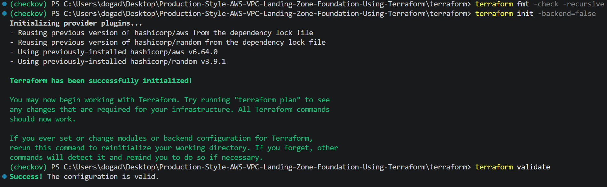
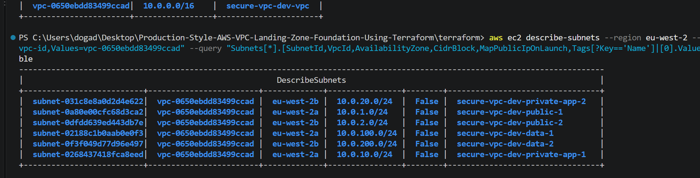
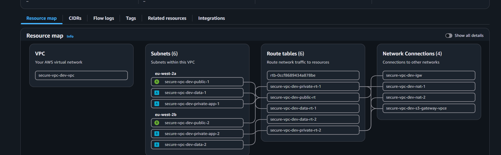
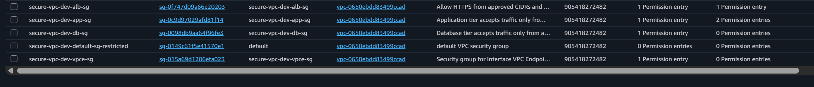
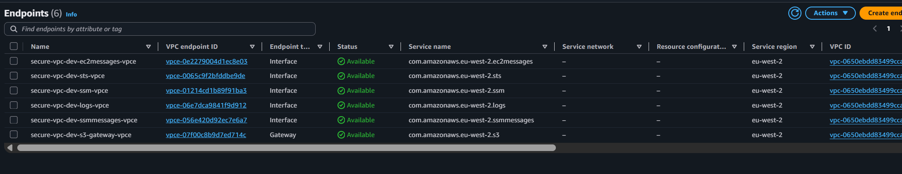
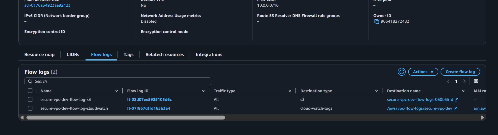
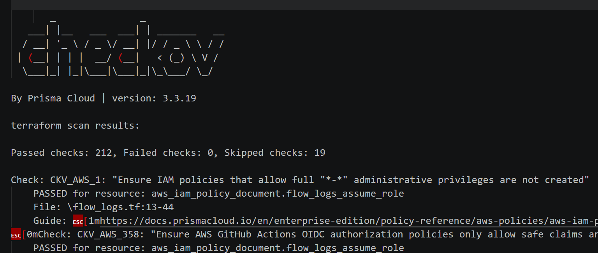

# Validation Evidence

This document records evidence that the Terraform configuration and deployed AWS network foundation implement the intended security architecture. Screenshots are stored in `docs/evidence/vpc/`.

## 1. Terraform Formatting and Validation



The screenshot records the results of:

```text
terraform fmt -check -recursive
terraform init -backend=false
terraform validate
```

Terraform formatting and configuration validation passed. The `-backend=false` option does not validate access to the remote state backend.

## 2. Terraform Plan


The Terraform plan was reviewed before deployment. It shows the expected VPC, subnet tiers, route tables, gateways, security groups, VPC endpoints and Flow Logs.

## 3. VPC and Subnet Segmentation



The deployed VPC separates resources into public ingress, private application and isolated data subnets across multiple Availability Zones. Subnet route table associations provide evidence of each tier’s effective routing.

## 4. Route Table Separation



| Subnet tier | Expected routing |
| --- | --- |
| Public ingress | `0.0.0.0/0` through an Internet Gateway |
| Private application | `0.0.0.0/0` through a NAT Gateway |
| Isolated data | No default internet route |

The route table evidence shows both routes and subnet associations. If IPv6 is enabled, the isolated data tier must also have no `::/0` internet route.

## 5. Security Group Trust Path



The security groups enforce the intended traffic path:

```text
Internet → ALB → Application → Database
```

Application ingress references the ALB security group, while database ingress references the application security group on the required ports. The database security group does not use broad internet or VPC-wide ingress rules.

## 6. VPC Endpoints



The endpoint evidence shows the selected AWS services, endpoint status and their subnet or route table associations. Gateway endpoints are associated with the route tables required by the architecture.

## 7. VPC Flow Logs



VPC Flow Logs are configured to provide network visibility for troubleshooting, security investigations and audit. The evidence shows the log status, traffic type and destination. Recent records at the destination should be included if claiming that log delivery was verified.

## 8. Infrastructure Security Scanning



The Terraform configuration was checked using TFLint, tfsec, Checkov and Terraform validation. The scan evidence records the results for the tested revision. Any suppressed or accepted findings should have a documented reason.

## 9. CI Validation


The GitHub Actions run shows formatting, Terraform validation and the configured Infrastructure as Code security checks passing for the relevant commit. If describing these checks as mandatory merge gates, retain evidence of the applicable branch protection rule or repository ruleset.

## Validation Result

The collected evidence documents:

- Multi-AZ public, private and isolated subnet segmentation.
- Controlled internet routing and private application egress.
- No default internet route for the isolated data tier.
- Security group boundaries between the ALB, application and database tiers.
- Private access to selected AWS services through VPC endpoints.
- VPC network telemetry through Flow Logs.
- Terraform and Infrastructure as Code checks in CI.

